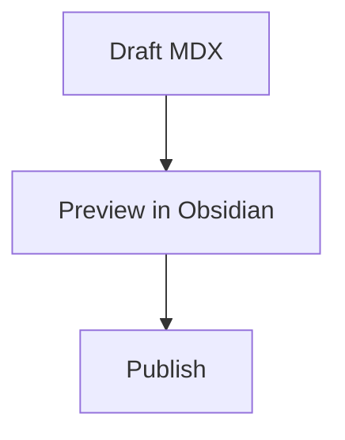

# MDX Preview

Preview [MDX](https://mdxjs.com/) files in [Obsidian](https://obsidian.md), with first-class support for [Code Hike](https://codehike.org) — scrollycoding, code annotations, focus lines, and compile-time syntax highlighting — plus [Mermaid](https://mermaid.js.org/) diagrams.

Forked from [yulei-chen/obsidian-mdx](https://github.com/yulei-chen/obsidian-mdx) and rewritten with a security-first architecture, mobile compatibility, and offline rendering.

## Why this plugin

Most MDX-related plugins for Obsidian only handle **editing** — they register `.mdx` as a plain-text file so Obsidian stops treating it as unknown, but they don't compile or render the MDX.

**MDX Preview** compiles your MDX so JSX and Code Hike annotations render in a live preview. Custom React components from your own app can't be resolved by the plugin, so they show a labeled placeholder rather than breaking the whole preview. Pair it with any edit-only plugin if you want richer editor support alongside the preview.

**Why not the original MDX by yulei-chen?** That plugin is the foundation this one was built on. This fork adds a security-first architecture (sandboxed iframe with a consent gate), bundles the renderer at build time so no internet connection is needed, and supports mobile.

## Features

- **Code Hike rendering** — scrollycoding, `!focus`, `!mark`, `!diff`, and all Code Hike annotations work out of the box
- **Mermaid diagrams** — `mermaid` code fences render as SVG diagrams, with per-diagram errors for invalid syntax
- **Compile-time syntax highlighting** — powered by [Code Hike](https://codehike.org) (whose `@code-hike/lighter` highlighter is pure JavaScript with no native dependencies), so it works on iOS and Android
- **Sandboxed execution** — MDX JavaScript runs in a null-origin `sandbox="allow-scripts"` iframe with no access to your vault or Obsidian APIs
- **Session consent gate** — you confirm once per session before any MDX JavaScript runs
- **Offline** — the renderer is bundled at build time; no CDN calls are made at runtime
- **Local image previews** — markdown and JSX images stored in the vault, including project-style `/images/...` paths backed by a nearby `public/` folder, render in desktop and mobile preview
- **Auto-open** — `.mdx` files open directly in the preview view, no command palette step needed
- **Debounced live reload** — preview updates 400 ms after you stop typing

## Installation

### Manual installation

1. Download `main.js`, `manifest.json`, and `styles.css` from the [latest release](https://github.com/jovialio/obsidian-mdx/releases).
2. Copy them into `.obsidian/plugins/mdx-preview/` inside your vault.
3. Enable the plugin in **Settings → Community Plugins → Installed Plugins**.

### Community plugin browser

Once listed, search for **MDX Preview** in **Settings → Community Plugins → Browse** and click Install.

## Usage

1. Create or open any file with a `.mdx` extension — it opens automatically in the preview view.
2. On first open, click **Enable MDX Preview** in the consent banner. MDX files contain executable JavaScript; the plugin asks once per session before rendering.
3. Use the **pencil / book toggle** in the top-right of the tab to switch between the rendered preview and an editable source view. Edits are saved to the file automatically.

### Code Hike example

Copy this into a `.mdx` file to try Code Hike annotations:

````mdx
export function Code({ codeblock }) {
  return <pre>{codeblock.value}</pre>
}

## Annotated code

```js !focus
// !mark[/greet/] red
function greet(name) {
  // !mark green
  return `Hello, ${name}!`
}
```
````

For a full scrollycoding example, see the [Code Hike vite example](https://github.com/code-hike/codehike/blob/next/examples/vite/src/hello.mdx).

### Mermaid example

Mermaid fences render as diagrams in preview:

````mdx

````

## Security model

MDX is executable JavaScript. This plugin takes several steps to limit the blast radius:

- The iframe uses `sandbox="allow-scripts"` with no `allow-same-origin`, giving it a null origin — vault files and Obsidian APIs are completely unreachable from inside the iframe
- No `eval()` or `new Function()` is used — the compiled MDX function body is embedded directly as a `<script>` tag, which is the same model browsers use for normal scripts
- The consent gate resets on every Obsidian restart, so you are always in control of when MDX JavaScript runs
- Outbound network requests from inside the iframe are still possible (this is a browser constraint, not something a plugin can block). Only preview files you trust.
- **Local images are embedded, so a file's scripts can read the images that file references.** To display vault images, the plugin inlines them as `data:` URLs — the only image form that loads in a null-origin sandbox (`app://` resource URLs and host-created `blob:` URLs are both origin-scoped and are blocked there). Because the image bytes live in the same iframe as the MDX JavaScript, a script can read the bytes of any vault image the file names (including a path it guesses) and send them over the network. This does not expose arbitrary vault files — only images the previewed file explicitly references — but it is why the rule above holds: only preview files you trust.
- Mermaid SVG output is generated inside the same sandboxed iframe with Mermaid's strict security mode. Invalid diagrams render a local error block instead of breaking the whole preview.

## Development

This repo uses `pnpm` (see `pnpm-lock.yaml`).

```bash
pnpm install
pnpm dev    # esbuild --watch, builds main.js + styles.css with inline sourcemaps
pnpm build  # tsc -noEmit type-check, then a minified production build
```

To see changes in Obsidian itself, symlink (or copy) `manifest.json`, `main.js`, and `styles.css` into a test vault at `.obsidian/plugins/mdx-preview/`, then reload Obsidian. Installing the community **Hot-Reload** plugin in that vault saves you from restarting Obsidian after every rebuild.

### Testing

```bash
pnpm test   # playwright test
```

[tests/e2e/preview.spec.ts](tests/e2e/preview.spec.ts) doesn't launch real Obsidian. It bundles the iframe renderer scripts with esbuild, compiles sample MDX through the same `@mdx-js/mdx` + `codehike/mdx` pipeline the plugin uses at runtime, and injects them into a sandboxed `srcdoc` iframe on a Playwright page, then asserts against the rendered DOM. This covers the renderer and MDX-compile pipeline in isolation — `src/main.ts` and `src/mdxPreview.tsx` (the Obsidian view wrapper) aren't exercised by these tests, so verifying those needs the manual vault loop above.

If Playwright reports a missing browser, run `pnpm exec playwright install chromium` once.

## Contributing

Issues and pull requests are welcome at [jovialio/obsidian-mdx](https://github.com/jovialio/obsidian-mdx).

## Behind the build

The decisions behind this plugin — mobile compatibility, offline rendering, eliminating `eval()`, and the sandboxed security model — are documented in detail:

[From Fork to Production: How I Rebuilt an Obsidian MDX Plugin](https://blog.synvest.life/writing/from-fork-to-production-obsidian-mdx-plugin)

## Credits

Originally forked from [yulei-chen/obsidian-mdx](https://github.com/yulei-chen/obsidian-mdx) by [yulei-chen](https://github.com/yulei-chen). Thank you for the foundation.

## License

MIT — see the [LICENSE](LICENSE) file for details.
